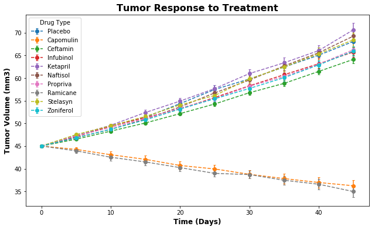
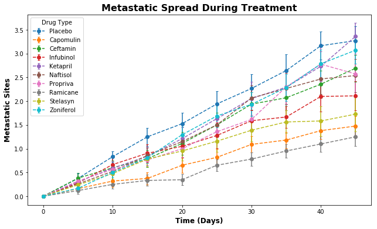
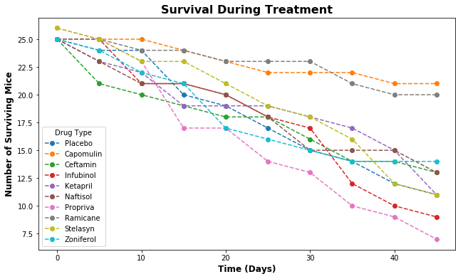
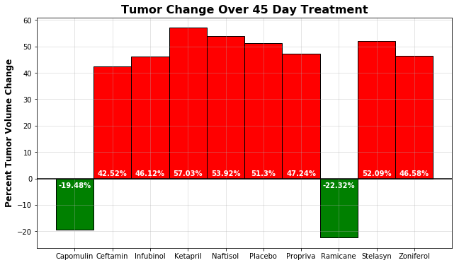

# Pymaceuticals Inc
GWU Data Analytics Bootcamp Homework 5

### Observations

* Of the various drug treatments, only Capomulin and Ramicane consistently perform significantly better than the Placebo.
* The difference in performance between Capomulin and Ramicane is likely not statistically significant.
* Ketapril appears to perform worse than the Placebo in tests regarding tumor growth and metastatic sites, but that difference is likely not statistically significant. 


```python
# Import Dependencies

import matplotlib.pyplot as plt
import pandas as pd
import numpy as np
from scipy.stats import sem

# Find and read in clinical trial data

trial_csv = "raw_data/clinicaltrial_data.csv"
trial_df = pd.read_csv(trial_csv)

# Find and read in mouse data

mouse_csv = "raw_data/mouse_drug_data.csv"
mouse_df = pd.read_csv(mouse_csv)

# Merge Data Sets

df = pd.merge(trial_df, mouse_df, on="Mouse ID")
df.head()
```

### Tumor Response to Treatment


```python
# Group Data by Drug and Timepoint

grouped_df = df.groupby(['Drug', 'Timepoint'])

# Calculate average tumor volume per checkpoint for each drug
# Calculate standard error of the means

avg_tumor_df = grouped_df.agg({'Tumor Volume (mm3)':['mean', 'sem']})

# Format dataframe

avg_tumor_df_reset = avg_tumor_df.reset_index()
avg_tumor_df_reset.columns = ['Drug', 'Timepoint', 'Tumor Mean', 'Tumor Error']

# Pivot data for better printing

drugs_tumors_df = avg_tumor_df_reset.pivot(index="Timepoint", columns="Drug", values="Tumor Mean")

# Print data

drugs_tumors_df
```

<table border="1" class="dataframe">
  <thead>
    <tr style="text-align: right;">
      <th>Drug</th>
      <th>Capomulin</th>
      <th>Ceftamin</th>
      <th>Infubinol</th>
      <th>Ketapril</th>
      <th>Naftisol</th>
      <th>Placebo</th>
      <th>Propriva</th>
      <th>Ramicane</th>
      <th>Stelasyn</th>
      <th>Zoniferol</th>
    </tr>
    <tr>
      <th>Timepoint</th>
      <th></th>
      <th></th>
      <th></th>
      <th></th>
      <th></th>
      <th></th>
      <th></th>
      <th></th>
      <th></th>
      <th></th>
    </tr>
  </thead>
  <tbody>
    <tr>
      <th>0</th>
      <td>45.000000</td>
      <td>45.000000</td>
      <td>45.000000</td>
      <td>45.000000</td>
      <td>45.000000</td>
      <td>45.000000</td>
      <td>45.000000</td>
      <td>45.000000</td>
      <td>45.000000</td>
      <td>45.000000</td>
    </tr>
    <tr>
      <th>5</th>
      <td>44.266086</td>
      <td>46.503051</td>
      <td>47.062001</td>
      <td>47.389175</td>
      <td>46.796098</td>
      <td>47.125589</td>
      <td>47.248967</td>
      <td>43.944859</td>
      <td>47.527452</td>
      <td>46.851818</td>
    </tr>
    <tr>
      <th>10</th>
      <td>43.084291</td>
      <td>48.285125</td>
      <td>49.403909</td>
      <td>49.582269</td>
      <td>48.694210</td>
      <td>49.423329</td>
      <td>49.101541</td>
      <td>42.531957</td>
      <td>49.463844</td>
      <td>48.689881</td>
    </tr>
    <tr>
      <th>15</th>
      <td>42.064317</td>
      <td>50.094055</td>
      <td>51.296397</td>
      <td>52.399974</td>
      <td>50.933018</td>
      <td>51.359742</td>
      <td>51.067318</td>
      <td>41.495061</td>
      <td>51.529409</td>
      <td>50.779059</td>
    </tr>
    <tr>
      <th>20</th>
      <td>40.716325</td>
      <td>52.157049</td>
      <td>53.197691</td>
      <td>54.920935</td>
      <td>53.644087</td>
      <td>54.364417</td>
      <td>53.346737</td>
      <td>40.238325</td>
      <td>54.067395</td>
      <td>53.170334</td>
    </tr>
    <tr>
      <th>25</th>
      <td>39.939528</td>
      <td>54.287674</td>
      <td>55.715252</td>
      <td>57.678982</td>
      <td>56.731968</td>
      <td>57.482574</td>
      <td>55.504138</td>
      <td>38.974300</td>
      <td>56.166123</td>
      <td>55.432935</td>
    </tr>
    <tr>
      <th>30</th>
      <td>38.769339</td>
      <td>56.769517</td>
      <td>58.299397</td>
      <td>60.994507</td>
      <td>59.559509</td>
      <td>59.809063</td>
      <td>58.196374</td>
      <td>38.703137</td>
      <td>59.826738</td>
      <td>57.713531</td>
    </tr>
    <tr>
      <th>35</th>
      <td>37.816839</td>
      <td>58.827548</td>
      <td>60.742461</td>
      <td>63.371686</td>
      <td>62.685087</td>
      <td>62.420615</td>
      <td>60.350199</td>
      <td>37.451996</td>
      <td>62.440699</td>
      <td>60.089372</td>
    </tr>
    <tr>
      <th>40</th>
      <td>36.958001</td>
      <td>61.467895</td>
      <td>63.162824</td>
      <td>66.068580</td>
      <td>65.600754</td>
      <td>65.052675</td>
      <td>63.045537</td>
      <td>36.574081</td>
      <td>65.356386</td>
      <td>62.916692</td>
    </tr>
    <tr>
      <th>45</th>
      <td>36.236114</td>
      <td>64.132421</td>
      <td>65.755562</td>
      <td>70.662958</td>
      <td>69.265506</td>
      <td>68.084082</td>
      <td>66.258529</td>
      <td>34.955595</td>
      <td>68.438310</td>
      <td>65.960888</td>
    </tr>
  </tbody>
</table>

```python
# Divide aggregated dataset by drug type

placebo_tumor_df = avg_tumor_df_reset.loc[avg_tumor_df_reset['Drug'] == 'Placebo', :]
capomulin_tumor_df = avg_tumor_df_reset.loc[avg_tumor_df_reset['Drug'] == 'Capomulin', :]
ceftamin_tumor_df = avg_tumor_df_reset.loc[avg_tumor_df_reset['Drug'] == 'Ceftamin', :]
infubinol_tumor_df = avg_tumor_df_reset.loc[avg_tumor_df_reset['Drug'] == 'Infubinol', :]
ketapril_tumor_df = avg_tumor_df_reset.loc[avg_tumor_df_reset['Drug'] == 'Ketapril', :]
naftisol_tumor_df = avg_tumor_df_reset.loc[avg_tumor_df_reset['Drug'] == 'Naftisol', :]
propriva_tumor_df = avg_tumor_df_reset.loc[avg_tumor_df_reset['Drug'] == 'Propriva', :]
ramicane_tumor_df = avg_tumor_df_reset.loc[avg_tumor_df_reset['Drug'] == 'Ramicane', :]
stelasyn_tumor_df = avg_tumor_df_reset.loc[avg_tumor_df_reset['Drug'] == 'Stelasyn', :]
zoniferol_tumor_df = avg_tumor_df_reset.loc[avg_tumor_df_reset['Drug'] == 'Zoniferol', :]

# Assign tumor volume means and standard errors to distinct variables for each drug

placebo_tumor_means = placebo_tumor_df['Tumor Mean']
placebo_tumor_errors = placebo_tumor_df['Tumor Error']

capomulin_tumor_means = capomulin_tumor_df['Tumor Mean']
capomulin_tumor_errors = capomulin_tumor_df['Tumor Error']

ceftamin_tumor_means = ceftamin_tumor_df['Tumor Mean']
ceftamin_tumor_errors = ceftamin_tumor_df['Tumor Error']

infubinol_tumor_means = infubinol_tumor_df['Tumor Mean']
infubinol_tumor_errors = infubinol_tumor_df['Tumor Error']

ketapril_tumor_means = ketapril_tumor_df['Tumor Mean']
ketapril_tumor_errors = ketapril_tumor_df['Tumor Error']

naftisol_tumor_means = naftisol_tumor_df['Tumor Mean']
naftisol_tumor_errors = naftisol_tumor_df['Tumor Error']

propriva_tumor_means = propriva_tumor_df['Tumor Mean']
propriva_tumor_errors = propriva_tumor_df['Tumor Error']

ramicane_tumor_means = ramicane_tumor_df['Tumor Mean']
ramicane_tumor_errors = ramicane_tumor_df['Tumor Error']

stelasyn_tumor_means = stelasyn_tumor_df['Tumor Mean']
stelasyn_tumor_errors = stelasyn_tumor_df['Tumor Error']

zoniferol_tumor_means = zoniferol_tumor_df['Tumor Mean']
zoniferol_tumor_errors = zoniferol_tumor_df['Tumor Error']

# Set x-axis values for chart

x_axis = drugs_tumors_df.index.values

# Format chart (size, labels, title, legend)

fig, ax = plt.subplots(figsize=(10.5,6))
ax.set_xlabel("Time (Days)", fontsize=12, fontweight='bold')
ax.set_ylabel("Tumor Volume (mm3)", fontsize=12, fontweight='bold')
ax.set_title("Tumor Response to Treatment", fontsize=16, fontweight='bold')
lgnd = ax.legend(loc="upper left", title="Drug Type")

# Add data to chart

ax.errorbar(x_axis, placebo_tumor_means, placebo_tumor_errors, fmt="--o", capsize=2, label="Placebo")
ax.errorbar(x_axis, capomulin_tumor_means, capomulin_tumor_errors, fmt="--o", capsize=2, label="Capomulin")
ax.errorbar(x_axis, ceftamin_tumor_means, ceftamin_tumor_errors, fmt="--o", capsize=2, label="Ceftamin")
ax.errorbar(x_axis, infubinol_tumor_means, infubinol_tumor_errors, fmt="--o", capsize=2, label="Infubinol")
ax.errorbar(x_axis, ketapril_tumor_means, ketapril_tumor_errors, fmt="--o", capsize=2, label="Ketapril")
ax.errorbar(x_axis, naftisol_tumor_means, naftisol_tumor_errors, fmt="--o", capsize=2, label="Naftisol")
ax.errorbar(x_axis, propriva_tumor_means, propriva_tumor_errors, fmt="--o", capsize=2, label="Propriva")
ax.errorbar(x_axis, ramicane_tumor_means, ramicane_tumor_errors, fmt="--o", capsize=2, label="Ramicane")
ax.errorbar(x_axis, stelasyn_tumor_means, stelasyn_tumor_errors, fmt="--o", capsize=2, label="Stelasyn")
ax.errorbar(x_axis, zoniferol_tumor_means, zoniferol_tumor_errors, fmt="--o", capsize=2, label="Zoniferol")
```



### Metastatic Response to Treatment


```python
# Calculate average tumor volume per checkpoint for each drug
# Calculate standard error of the means

avg_sites_df = grouped_df.agg({'Metastatic Sites':['mean', 'sem']})

# Format dataframe

avg_sites_df_reset = avg_sites_df.reset_index()
avg_sites_df_reset.columns = ['Drug', 'Timepoint', 'Metastatic Mean', 'Metastatic Error']

# Pivot data for better printing

drugs_sites_df = avg_sites_df_reset.pivot(index="Timepoint", columns="Drug", values="Metastatic Mean")

# Print data

drugs_sites_df
```

<table border="1" class="dataframe">
  <thead>
    <tr style="text-align: right;">
      <th>Drug</th>
      <th>Capomulin</th>
      <th>Ceftamin</th>
      <th>Infubinol</th>
      <th>Ketapril</th>
      <th>Naftisol</th>
      <th>Placebo</th>
      <th>Propriva</th>
      <th>Ramicane</th>
      <th>Stelasyn</th>
      <th>Zoniferol</th>
    </tr>
    <tr>
      <th>Timepoint</th>
      <th></th>
      <th></th>
      <th></th>
      <th></th>
      <th></th>
      <th></th>
      <th></th>
      <th></th>
      <th></th>
      <th></th>
    </tr>
  </thead>
  <tbody>
    <tr>
      <th>0</th>
      <td>0.000000</td>
      <td>0.000000</td>
      <td>0.000000</td>
      <td>0.000000</td>
      <td>0.000000</td>
      <td>0.000000</td>
      <td>0.000000</td>
      <td>0.000000</td>
      <td>0.000000</td>
      <td>0.000000</td>
    </tr>
    <tr>
      <th>5</th>
      <td>0.160000</td>
      <td>0.380952</td>
      <td>0.280000</td>
      <td>0.304348</td>
      <td>0.260870</td>
      <td>0.375000</td>
      <td>0.320000</td>
      <td>0.120000</td>
      <td>0.240000</td>
      <td>0.166667</td>
    </tr>
    <tr>
      <th>10</th>
      <td>0.320000</td>
      <td>0.600000</td>
      <td>0.666667</td>
      <td>0.590909</td>
      <td>0.523810</td>
      <td>0.833333</td>
      <td>0.565217</td>
      <td>0.250000</td>
      <td>0.478261</td>
      <td>0.500000</td>
    </tr>
    <tr>
      <th>15</th>
      <td>0.375000</td>
      <td>0.789474</td>
      <td>0.904762</td>
      <td>0.842105</td>
      <td>0.857143</td>
      <td>1.250000</td>
      <td>0.764706</td>
      <td>0.333333</td>
      <td>0.782609</td>
      <td>0.809524</td>
    </tr>
    <tr>
      <th>20</th>
      <td>0.652174</td>
      <td>1.111111</td>
      <td>1.050000</td>
      <td>1.210526</td>
      <td>1.150000</td>
      <td>1.526316</td>
      <td>1.000000</td>
      <td>0.347826</td>
      <td>0.952381</td>
      <td>1.294118</td>
    </tr>
    <tr>
      <th>25</th>
      <td>0.818182</td>
      <td>1.500000</td>
      <td>1.277778</td>
      <td>1.631579</td>
      <td>1.500000</td>
      <td>1.941176</td>
      <td>1.357143</td>
      <td>0.652174</td>
      <td>1.157895</td>
      <td>1.687500</td>
    </tr>
    <tr>
      <th>30</th>
      <td>1.090909</td>
      <td>1.937500</td>
      <td>1.588235</td>
      <td>2.055556</td>
      <td>2.066667</td>
      <td>2.266667</td>
      <td>1.615385</td>
      <td>0.782609</td>
      <td>1.388889</td>
      <td>1.933333</td>
    </tr>
    <tr>
      <th>35</th>
      <td>1.181818</td>
      <td>2.071429</td>
      <td>1.666667</td>
      <td>2.294118</td>
      <td>2.266667</td>
      <td>2.642857</td>
      <td>2.300000</td>
      <td>0.952381</td>
      <td>1.562500</td>
      <td>2.285714</td>
    </tr>
    <tr>
      <th>40</th>
      <td>1.380952</td>
      <td>2.357143</td>
      <td>2.100000</td>
      <td>2.733333</td>
      <td>2.466667</td>
      <td>3.166667</td>
      <td>2.777778</td>
      <td>1.100000</td>
      <td>1.583333</td>
      <td>2.785714</td>
    </tr>
    <tr>
      <th>45</th>
      <td>1.476190</td>
      <td>2.692308</td>
      <td>2.111111</td>
      <td>3.363636</td>
      <td>2.538462</td>
      <td>3.272727</td>
      <td>2.571429</td>
      <td>1.250000</td>
      <td>1.727273</td>
      <td>3.071429</td>
    </tr>
  </tbody>
</table>

```python
# Divide aggregated dataset by drug type

placebo_sites_df = avg_sites_df_reset.loc[avg_sites_df_reset['Drug'] == 'Placebo', :]
capomulin_sites_df = avg_sites_df_reset.loc[avg_sites_df_reset['Drug'] == 'Capomulin', :]
ceftamin_sites_df = avg_sites_df_reset.loc[avg_sites_df_reset['Drug'] == 'Ceftamin', :]
infubinol_sites_df = avg_sites_df_reset.loc[avg_sites_df_reset['Drug'] == 'Infubinol', :]
ketapril_sites_df = avg_sites_df_reset.loc[avg_sites_df_reset['Drug'] == 'Ketapril', :]
naftisol_sites_df = avg_sites_df_reset.loc[avg_sites_df_reset['Drug'] == 'Naftisol', :]
propriva_sites_df = avg_sites_df_reset.loc[avg_sites_df_reset['Drug'] == 'Propriva', :]
ramicane_sites_df = avg_sites_df_reset.loc[avg_sites_df_reset['Drug'] == 'Ramicane', :]
stelasyn_sites_df = avg_sites_df_reset.loc[avg_sites_df_reset['Drug'] == 'Stelasyn', :]
zoniferol_sites_df = avg_sites_df_reset.loc[avg_sites_df_reset['Drug'] == 'Zoniferol', :]

# Assign tumor volume means and standard errors to distinct variables for each drug

placebo_sites_means = placebo_sites_df['Metastatic Mean']
placebo_sites_errors = placebo_sites_df['Metastatic Error']

capomulin_sites_means = capomulin_sites_df['Metastatic Mean']
capomulin_sites_errors = capomulin_sites_df['Metastatic Error']

ceftamin_sites_means = ceftamin_sites_df['Metastatic Mean']
ceftamin_sites_errors = ceftamin_sites_df['Metastatic Error']

infubinol_sites_means = infubinol_sites_df['Metastatic Mean']
infubinol_sites_errors = infubinol_sites_df['Metastatic Error']

ketapril_sites_means = ketapril_sites_df['Metastatic Mean']
ketapril_sites_errors = ketapril_sites_df['Metastatic Error']

naftisol_sites_means = naftisol_sites_df['Metastatic Mean']
naftisol_sites_errors = naftisol_sites_df['Metastatic Error']

propriva_sites_means = propriva_sites_df['Metastatic Mean']
propriva_sites_errors = propriva_sites_df['Metastatic Error']

ramicane_sites_means = ramicane_sites_df['Metastatic Mean']
ramicane_sites_errors = ramicane_sites_df['Metastatic Error']

stelasyn_sites_means = stelasyn_sites_df['Metastatic Mean']
stelasyn_sites_errors = stelasyn_sites_df['Metastatic Error']

zoniferol_sites_means = zoniferol_sites_df['Metastatic Mean']
zoniferol_sites_errors = zoniferol_sites_df['Metastatic Error']

# Set x-axis values for chart

x_axis = drugs_sites_df.index.values

# Format chart (size, labels, title, legend)

fig, ax = plt.subplots(figsize=(10.5,6))
ax.set_xlabel("Time (Days)", fontsize=12, fontweight='bold')
ax.set_ylabel("Metastatic Sites", fontsize=12, fontweight='bold')
ax.set_title("Metastatic Spread During Treatment", fontsize=16, fontweight='bold')
lgnd = ax.legend(loc="upper left", title="Drug Type")

# Add data to chart

ax.errorbar(x_axis, placebo_sites_means, placebo_sites_errors, fmt="--o", capsize=2, label="Placebo")
ax.errorbar(x_axis, capomulin_sites_means, capomulin_sites_errors, fmt="--o", capsize=2, label="Capomulin")
ax.errorbar(x_axis, ceftamin_sites_means, ceftamin_sites_errors, fmt="--o", capsize=2, label="Ceftamin")
ax.errorbar(x_axis, infubinol_sites_means, infubinol_sites_errors, fmt="--o", capsize=2, label="Infubinol")
ax.errorbar(x_axis, ketapril_sites_means, ketapril_sites_errors, fmt="--o", capsize=2, label="Ketapril")
ax.errorbar(x_axis, naftisol_sites_means, naftisol_sites_errors, fmt="--o", capsize=2, label="Naftisol")
ax.errorbar(x_axis, propriva_sites_means, propriva_sites_errors, fmt="--o", capsize=2, label="Propriva")
ax.errorbar(x_axis, ramicane_sites_means, ramicane_sites_errors, fmt="--o", capsize=2, label="Ramicane")
ax.errorbar(x_axis, stelasyn_sites_means, stelasyn_sites_errors, fmt="--o", capsize=2, label="Stelasyn")
ax.errorbar(x_axis, zoniferol_sites_means, zoniferol_sites_errors, fmt="--o", capsize=2, label="Zoniferol")
```



### Survival Rate


```python
# Calculate surviving mouse count at each timepoint for each drug

mouse_count_df = grouped_df['Mouse ID'].count()

# Reset index on dataframe to facilitate pivoting and graphing

mouse_count_df_reset = mouse_count_df.reset_index()

# Pivot data for better printing

drugs_mice_df = mouse_count_df_reset.pivot(index="Timepoint", columns="Drug", values="Mouse ID")

# Print data

drugs_mice_df
```

<table border="1" class="dataframe">
  <thead>
    <tr style="text-align: right;">
      <th>Drug</th>
      <th>Capomulin</th>
      <th>Ceftamin</th>
      <th>Infubinol</th>
      <th>Ketapril</th>
      <th>Naftisol</th>
      <th>Placebo</th>
      <th>Propriva</th>
      <th>Ramicane</th>
      <th>Stelasyn</th>
      <th>Zoniferol</th>
    </tr>
    <tr>
      <th>Timepoint</th>
      <th></th>
      <th></th>
      <th></th>
      <th></th>
      <th></th>
      <th></th>
      <th></th>
      <th></th>
      <th></th>
      <th></th>
    </tr>
  </thead>
  <tbody>
    <tr>
      <th>0</th>
      <td>25</td>
      <td>25</td>
      <td>25</td>
      <td>25</td>
      <td>25</td>
      <td>25</td>
      <td>26</td>
      <td>25</td>
      <td>26</td>
      <td>25</td>
    </tr>
    <tr>
      <th>5</th>
      <td>25</td>
      <td>21</td>
      <td>25</td>
      <td>23</td>
      <td>23</td>
      <td>24</td>
      <td>25</td>
      <td>25</td>
      <td>25</td>
      <td>24</td>
    </tr>
    <tr>
      <th>10</th>
      <td>25</td>
      <td>20</td>
      <td>21</td>
      <td>22</td>
      <td>21</td>
      <td>24</td>
      <td>23</td>
      <td>24</td>
      <td>23</td>
      <td>22</td>
    </tr>
    <tr>
      <th>15</th>
      <td>24</td>
      <td>19</td>
      <td>21</td>
      <td>19</td>
      <td>21</td>
      <td>20</td>
      <td>17</td>
      <td>24</td>
      <td>23</td>
      <td>21</td>
    </tr>
    <tr>
      <th>20</th>
      <td>23</td>
      <td>18</td>
      <td>20</td>
      <td>19</td>
      <td>20</td>
      <td>19</td>
      <td>17</td>
      <td>23</td>
      <td>21</td>
      <td>17</td>
    </tr>
    <tr>
      <th>25</th>
      <td>22</td>
      <td>18</td>
      <td>18</td>
      <td>19</td>
      <td>18</td>
      <td>17</td>
      <td>14</td>
      <td>23</td>
      <td>19</td>
      <td>16</td>
    </tr>
    <tr>
      <th>30</th>
      <td>22</td>
      <td>16</td>
      <td>17</td>
      <td>18</td>
      <td>15</td>
      <td>15</td>
      <td>13</td>
      <td>23</td>
      <td>18</td>
      <td>15</td>
    </tr>
    <tr>
      <th>35</th>
      <td>22</td>
      <td>14</td>
      <td>12</td>
      <td>17</td>
      <td>15</td>
      <td>14</td>
      <td>10</td>
      <td>21</td>
      <td>16</td>
      <td>14</td>
    </tr>
    <tr>
      <th>40</th>
      <td>21</td>
      <td>14</td>
      <td>10</td>
      <td>15</td>
      <td>15</td>
      <td>12</td>
      <td>9</td>
      <td>20</td>
      <td>12</td>
      <td>14</td>
    </tr>
    <tr>
      <th>45</th>
      <td>21</td>
      <td>13</td>
      <td>9</td>
      <td>11</td>
      <td>13</td>
      <td>11</td>
      <td>7</td>
      <td>20</td>
      <td>11</td>
      <td>14</td>
    </tr>
  </tbody>
</table>

```python
# Divide aggregated dataset by drug type

placebo_mice_df = mouse_count_df_reset.loc[mouse_count_df_reset['Drug'] == 'Placebo', :]
capomulin_mice_df = mouse_count_df_reset.loc[mouse_count_df_reset['Drug'] == 'Capomulin', :]
ceftamin_mice_df = mouse_count_df_reset.loc[mouse_count_df_reset['Drug'] == 'Ceftamin', :]
infubinol_mice_df = mouse_count_df_reset.loc[mouse_count_df_reset['Drug'] == 'Infubinol', :]
ketapril_mice_df = mouse_count_df_reset.loc[mouse_count_df_reset['Drug'] == 'Ketapril', :]
naftisol_mice_df = mouse_count_df_reset.loc[mouse_count_df_reset['Drug'] == 'Naftisol', :]
propriva_mice_df = mouse_count_df_reset.loc[mouse_count_df_reset['Drug'] == 'Propriva', :]
ramicane_mice_df = mouse_count_df_reset.loc[mouse_count_df_reset['Drug'] == 'Ramicane', :]
stelasyn_mice_df = mouse_count_df_reset.loc[mouse_count_df_reset['Drug'] == 'Stelasyn', :]
zoniferol_mice_df = mouse_count_df_reset.loc[mouse_count_df_reset['Drug'] == 'Zoniferol', :]

# Set x-axis values for chart

x_axis = drugs_mice_df.index.values

# Format chart (size, labels, title, legend)

plt.subplots(figsize=(10.5,6))
plt.xlabel("Time (Days)", fontsize=12, fontweight='bold')
plt.ylabel("Number of Surviving Mice", fontsize=12, fontweight='bold')
plt.title("Survival During Treatment", fontsize=16, fontweight='bold')
lgnd = plt.legend(loc="best", title="Drug Type")

# Add data to chart

plt.plot(placebo_mice_df['Timepoint'], placebo_mice_df['Mouse ID'], '--o', label="Placebo")
plt.plot(capomulin_mice_df['Timepoint'], capomulin_mice_df['Mouse ID'], '--o', label="Capomulin")
plt.plot(ceftamin_mice_df['Timepoint'], ceftamin_mice_df['Mouse ID'], '--o', label="Ceftamin")
plt.plot(infubinol_mice_df['Timepoint'], infubinol_mice_df['Mouse ID'], '--o', label="Infubinol")
plt.plot(ketapril_mice_df['Timepoint'], ketapril_mice_df['Mouse ID'], '--o', label="Ketapril")
plt.plot(naftisol_mice_df['Timepoint'], naftisol_mice_df['Mouse ID'], '--o', label="Naftisol")
plt.plot(propriva_mice_df['Timepoint'], propriva_mice_df['Mouse ID'], '--o', label="Propriva")
plt.plot(ramicane_mice_df['Timepoint'], ramicane_mice_df['Mouse ID'], '--o', label="Ramicane")
plt.plot(stelasyn_mice_df['Timepoint'], stelasyn_mice_df['Mouse ID'], '--o', label="Stelasyn")
plt.plot(zoniferol_mice_df['Timepoint'], zoniferol_mice_df['Mouse ID'], '--o', label="Zoniferol")
```





### Percent Change in Tumor Volume


```python
# Format aggregated tumor volume dataframe

percent_change_df = avg_tumor_df.xs('Tumor Volume (mm3)', axis=1, drop_level=True)
percent_change_df_reset = percent_change_df.reset_index()

# Filter data to average tumor volume at final timepoint

percent_change_df_fortyfive = percent_change_df_reset.loc[percent_change_df_reset['Timepoint'] == 45, ['Drug', 'mean']]

# Calculate percent change in tumor volume for each drug

percent_change_df_fortyfive['Percent Change'] = ((percent_change_df_fortyfive['mean'] - 45) / 45) * 100

# Create function to calculate whether percent change is positive or negative
# Function returns True if positive or zero and False if negative

def above_zero(row):
    if row['Percent Change'] >= 0 :
        return True
    else:
        return False

# Add column to dataframe indicating whether percent change is positive or negative
    
percent_change_df_fortyfive['above_zero'] = percent_change_df_fortyfive.apply (lambda row: above_zero (row),axis=1)

# Assign aspects of data needed for charting to variables

percent_change = percent_change_df_fortyfive['Percent Change']
xlabels = percent_change_df_fortyfive['Drug']
x_axis = np.arange(len(percent_change))

fig, ax = plt.subplots(figsize=(10.5, 6))
percent_plot = ax.bar(x_axis, percent_change, width=1.0, edgecolor="black", color=percent_change_df_fortyfive.above_zero.map({True: 'r', False: 'g'}))
ax.set_xticks(x_axis)
ax.set_xticklabels(xlabels)

ax.set_ylabel("Percent Tumor Volume Change", fontsize=12, fontweight="bold")
ax.set_xlabel("")
ax.set_title("Tumor Change Over 45 Day Treatment", fontsize=16, fontweight="bold")

plt.axhline(y=0, color="black", linestyle='-')
plt.grid(alpha=0.4)

# Create function to calculate where to add data labels to chart and what text to add and to place labels

def autolabel(rects, ax):
    (y_bottom, y_top) = ax.get_ylim()
    y_height = y_top - y_bottom

    for rect in rects:
        height = rect.get_height()

        p_height = (height / y_height)

        if height > 0:
            label_position = 0.5
        elif height < 0:
            label_position = -4

        ax.text(rect.get_x() + rect.get_width()/2., label_position,
                str(round(height, 2))+'%',
                ha='center', va='bottom', color="white", fontweight="bold")

# Calculate data labels and add to chart
        
autolabel(percent_plot, ax)
```




